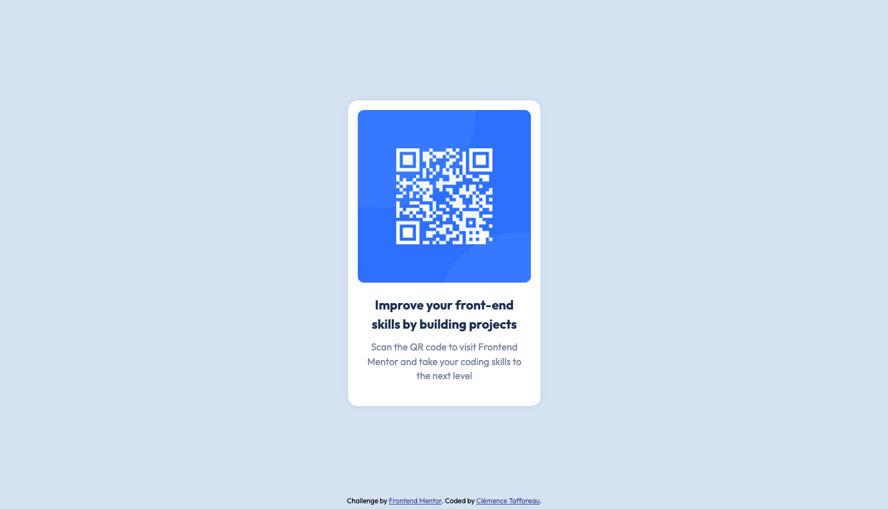

# Frontend-Mentor-QR-code-component
A solution submitted for Frontend Mentor's QR code component challenge. 

# Frontend Mentor - QR code component solution

This is a solution to the [QR code component challenge on Frontend Mentor](https://www.frontendmentor.io/challenges/qr-code-component-iux_sIO_H). Frontend Mentor challenges help you improve your coding skills by building realistic projects. 

## Table of contents

- [Overview](#overview)
  - [Screenshot](#screenshot)
  - [Links](#links)
- [My process](#my-process)
  - [Built with](#built-with)
  - [What I learned](#what-i-learned)
  - [Continued development](#continued-development)
  - [Useful resources](#useful-resources)
- [Author](#author)

## Overview

### Screenshot

### Links

- Solution URL: (https://github.com/ClemenceTafforeau/Frontend-Mentor-QR-code-component)
- Live Site URL: (https://clemencetafforeau.github.io/Frontend-Mentor-QR-code-component/)

## My process

### Built with

- Semantic HTML5 markup
- CSS custom properties
- Flexbox

### What I learned

- How to vertically center a div

### Continued development

I need to keep on practicing with Flexbox.

### Useful resources

- [Andy Bell's Modern CSS Reset](https://gist.github.com/Asjas/4b0736108d56197fce0ec9068145b421)
- [Kevin Powell's Youtube Channel](https://www.youtube.com/@KevinPowell) - I find his channel very useful, and I often go back to watch some of his videos when I forget about certain concepts.

## Author

- Frontend Mentor - [@ClemenceTafforeau](https://www.frontendmentor.io/profile/ClemenceTafforeau)
